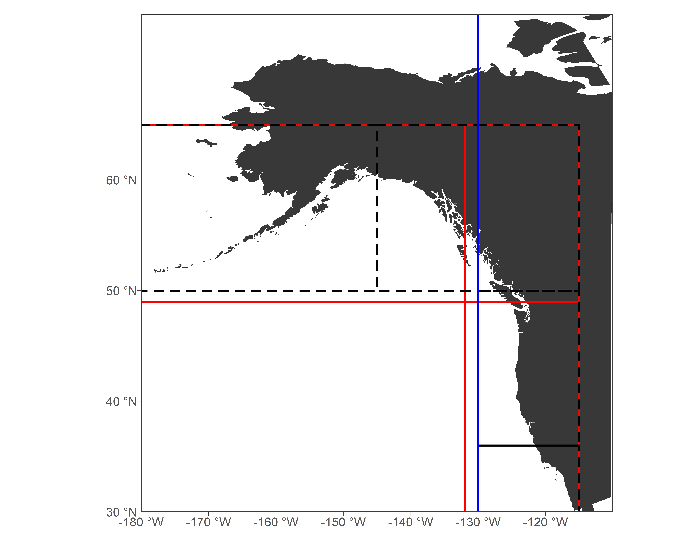
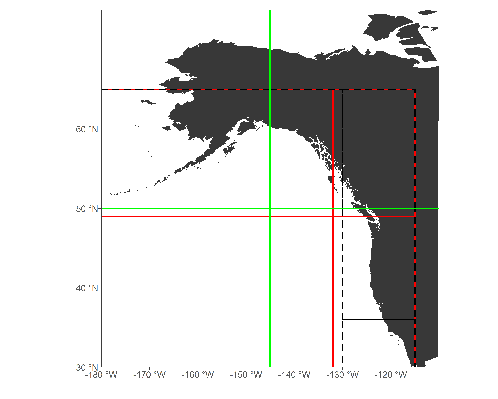
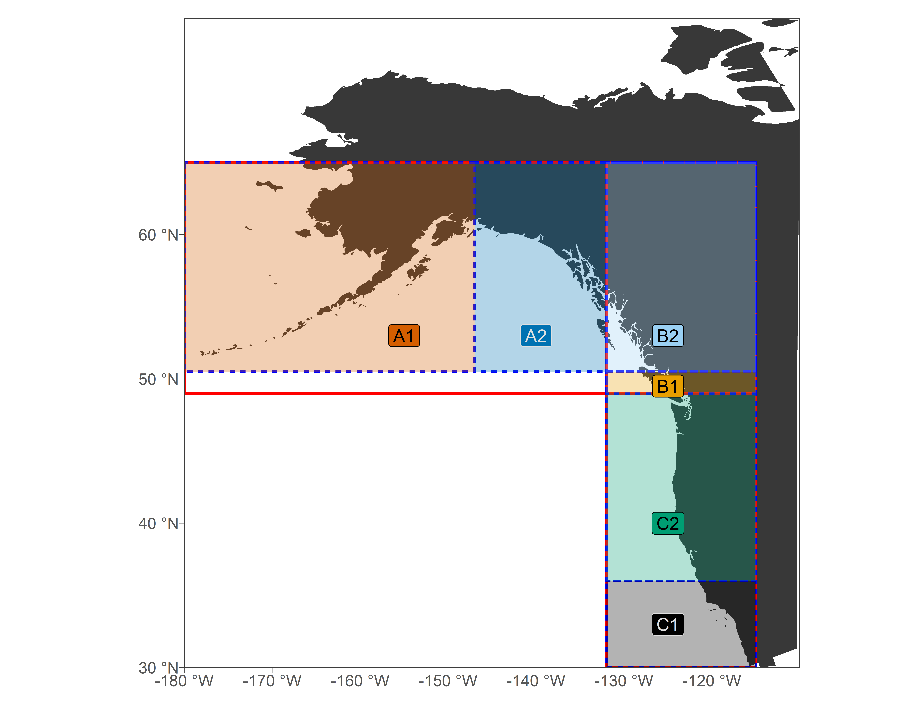
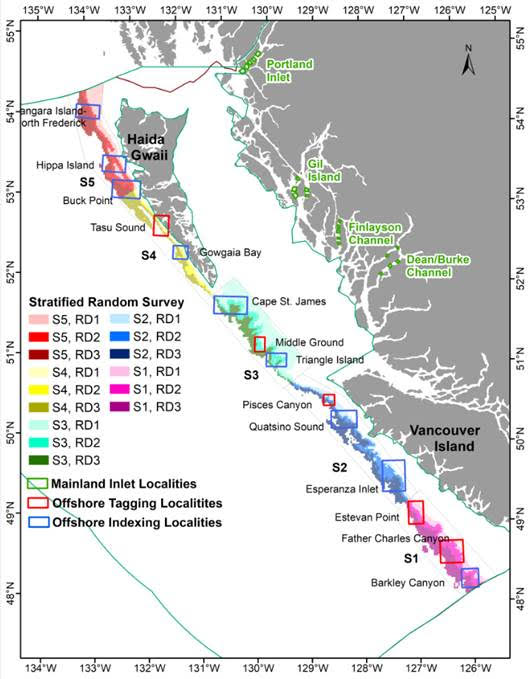
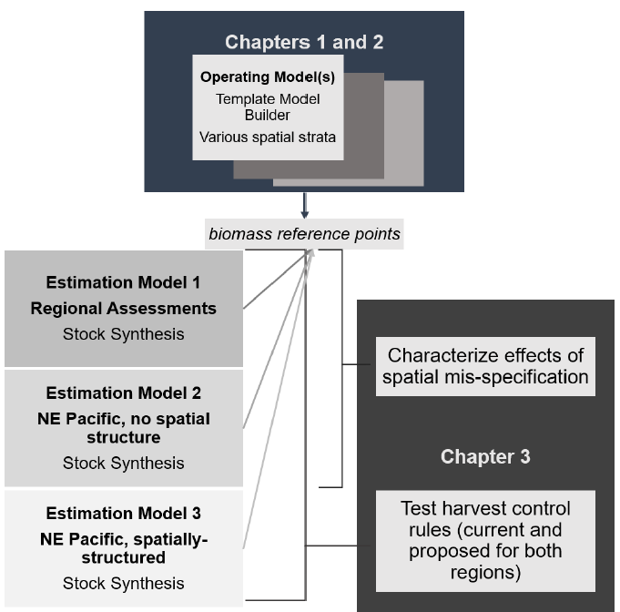

```{r options, include = FALSE, eval = TRUE}
knitr::opts_chunk$set(warning = FALSE, message = FALSE,fig.align='center',
                      fig.width = 3, fig.height = 3,
                      comment = NA, rows.print = 16)
```

---
# Topics herein

+ Luke's spatial proposal (decrease # subareas)
+ Research questions from my PhD proposal
+ EM Scenarios
+ Performance metrics

???
2nd and third are place to discuss Brendan's suggestion of hearing from AEP/Dan/Aaron on other questions, directions

# Luke's Spatial Proposal 
## Original demographic breakpoints
Leads to 7 sub areas
```{r, echo = -1, eval = TRUE, out.height=400, out.width= 500}
knitr::include_graphics("img/Fig1_strata_mapsB.png")
```

---

# Luke's Spatial Proposal 
## Delete break @ 130W

```{r, echo = -1, eval = TRUE, out.height=400, out.width= 500}

```

---
# Luke's Spatial Proposal 
## Shift these to match NMFS boundaries and GMU areas

```{r, echo = -1, eval = TRUE, out.height=400, out.width= 500}

```

---
# Luke's Spatial Proposal 
## Resultant new sub-areas (6)
```{r, echo = -1, eval = TRUE, out.height=400, out.width= 500}

```


---
## Close up of BC
```{r, echo = -1, eval = TRUE, out.height=400, out.width= 500}

```

???

My thoughts:
implications of "disregarding" growth findings
keep in mind that movement and breaks aren't necessarily incogruous - note how the 49th "parallel" is angled in the projected image, as should the 50th parallel, etc
But, no matter what including the 130* breakpt cuts a sliver of BC out so if they are against it no problem
---

# .small[Research Questions from Maia's PhD Proposal]


+ .inverse[What are the consequences of a spatially-explicit, range-wide assessment model for NE Pacific sablefish?]

???

split this up into the question and tool (models/scenarios) used to answer it

---

# Research Questions I

.inverse[[The present OM]]

+ Does such an operating model produce similar or different population dynamics as suggested by the current regional assessments? 

---

```{r, echo = -1, eval = TRUE, out.height=400, out.width= 400}

```


---
# Research Questions II

.inverse[[EMs with spatial structure similar to/distinct from the OM]]

.pull-left[]

???

Ignore mention of SS etc

--

.pull-right[ 
What is the degree of bias or error in estimated management quantities for sablefish <br> if the spatial structure in the assessment diverges from "reality"? 

]

???

This is accomplished by comparing EMs that do or don't match the OM spatial structure. Could also be done using an EM that matches the OM, vs regional assessments.

[for next slide]
Develop HCRs and see if we can get better performance metrics using spatial OM + EM vs spatial OM + current mgmt framework

---
# Research Questions III
.inverse[[EMs with spatial structure similar to/distinct from the OM]]

.pull-left[]

--

.pull-right[
+ Are there particular combinations of harvest control rules and spatial assessment frameworks that would reduce undesirable OR preferable outcomes for the sablefish fishery or population? 
]


---
# .small[Thoughts Arising w.r.t Estimation Models I]

+ "Current management framework" $\neq$ "A regional assessment model", e.g. BC has its own MP which involves an OM and Schaefer model

--

+ Will need to decide on baseline for "current management" -- print data from OM and hand to regional models/MPs? Or use custom EM?


---
# .small[Thoughts Arising w.r.t Estimation Models II]

Likely EM Scenarios* 
+ A near-match to the OM
+ A simplification of the OM 
+ Regional assessments (see previous slide)
+ Panmictic .inverse(is this high priority?)]
+ .inverse[others?]

--

*note that much work has been done on spatial mismatch in general, so a full crosswise study may be retracing others' steps
---
# Performance Metrics
+ Performance metrics: start simple and steal from others. 
Ideas:
AAV in catch (limit this),
Directed yield (maximize this)
Minimize discard mortality
Keep biomass above trigger limits


