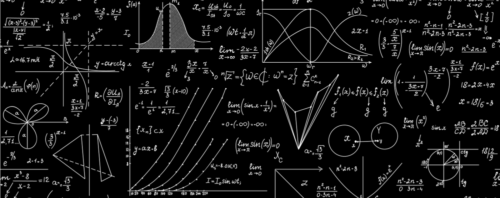

```{r xaringan-themer, include = FALSE}
library(xaringanthemer)
duo_accent(
  primary_color = "black", 
  secondary_color = "grey22",
  title_slide_text_color = "#f8f9fa", 
  text_color = "#404040", 
  link_color = "dodgerblue4",
  inverse_text_color = "goldenrod", 
  inverse_header_color = "#f8f9fa",
  text_font_size = "22px",
  header_font_google = google_font("Helvetica", "400"),
  text_font_google   = google_font("Helvetica", "400", "400i"),
  code_font_google   = google_font("Source Code Pro"),
  background_size = "cover", outfile = "rstudioconf-xaringan-themer.css"
)
```

```{r options, include = FALSE, eval = TRUE}
knitr::opts_chunk$set(warning = FALSE, message = FALSE,fig.align='center',
                      fig.width = 3, fig.height = 3,
                      comment = NA, rows.print = 16)
```

layout: true

.header[`r icon::fa('github')` @mkapur/sab-mse/]

---
# Objectives

+ Provide overview of Operating Model design (beta, obviously)
+ Discuss assumptions, data inputs & treatment

--

##  Outline
+ General model framework
+ Walk-through details from [document](OM_Desc_10Apr2020.pdf)
+ Discuss as we go (interrupt me  `r emo::ji("smile")`)


---

# Ground Floor

.pull-left[
+ OM is written in `R`

+ Conditioning +/- estimation happens in `TMB`
+ We are <b>not</b> shooting to replicate Stock Synthesis (etc.) exactly 
]

.pull-right[

]
---


# Spatial Structure
+ A little more complicated than expected


--

+ Let's walk through how these came about

---

# Spatial Structure

```{r, echo = -1, eval = TRUE, out.height=400, out.width= 500}
knitr::include_graphics("/docs/slides/img/Fig1_strata_mapsA.png")
```

???

Also -- Space is confusing, so let's abstract these 
---

# Management Regions

```{r, echo = -1, eval = TRUE, out.height=400, out.width= 500}
knitr::include_graphics("/docs/slides/img/Fig1_strata_mapsA2.png")
```

---
## Stock (demography)


```{r, echo = -1, eval = TRUE, out.height=400, out.width= 500}
knitr::include_graphics("/docs/slides/img/Fig1_strata_mapsB.png")
```

???


---

## Sub-Areas (what's modeled)

```{r, echo = -1, eval = TRUE, out.height=400, out.width= 500}
knitr::include_graphics("/docs/slides/img/Fig1_strata_mapsC.png")
```

---


### Putting it all together (fleets + surveys)


---
# What happens where
## Management Regions $m$ 

.pull-left[

Alaska (AK), British Columbia (BC), Cal. Current (CC)
  + Contain fleets
  + Accrue catches
  + Set ABCs (future)


]

.pull-right[

]
---
# What happens where
## Stocks $k$

.pull-left[

R1:R5, as in Kapur et al. (2019)
+ Share params for growth, maturity(?), **density-dependence**
+ SRR operates @ $k$ and is partitioned
]

.pull-right[

]
---
# What happens where
## Sub-areas $i,j$

.pull-left[
+ A,B,C = AK-, BC-, CC-nested
+ Strata @ which pops. are modeled
]

.pull-right[

]

---
background-image: url("http://bit.ly/cs631-donkey")
background-size: cover
---

# Basic Dynamics
.pull-center[

]
--
**Equation in Document**
+ Key assumptions
+ .inverse[Discuss me]

---

.pull-center[

]
--

**Eq 1**

+ Yearly timestep
+ Monitored by sub-area $i$
+ Movement defined by $\textbf{X}^{i,j}$
+ .inverse[Plus group for age/length: 95yr/50cm]

---
# Growth


**Eqs 2:5**
+ Growth indexed by stock $k$ via Kapur et al. (2019)
+ Plus group via weighted average
+ .inverse[Plus group for length: 50cm]

---
# Length to Weight

**Eqs 6:7**
+ $\alpha, \beta$ .inverse[ vary by stock]
+ different $w^{f}_{a}$ for catches

---
# Reproduction

**Eqs 8:10**
+ Density dependence spatial Bev-Holt at stock level $k$
+ Steepness $h^k$ .inverse[estimated with penalty/as hyper-parameter?]
+ $R_y^{k}$ .inverse[partitioned to sub-areas] $i$ via eigenvector of $\textbf{X}^{i,j}$


---

## Fleets (general data availability)

Note that VAST "combined" some fleets

.pull-center[

]

---

## Discards & Catches

---

## Surveys 

---

## Selectivity


---
background-image: url("https://media.giphy.com/media/10uVasOeFs6U92/giphy.gif")
background-size: cover

<br><br><br>
# Model Conditioning
---
## Model Conditioning

+ TMB (for OM); .inverse[Stock Synthesis for EMs?]
+ Starter equations under "Likelihoods", ppXX
+ Let's focus on key topics first
---

## Misc Questions
+ start year for whole model
+ aging error
+ expansions of comps, etc
+ data availability (by stock vs mgmt area)
+ treament of sample sizes -- dirichlet?
+ hyperparameters e.g. steepness, penalty on recdevs

