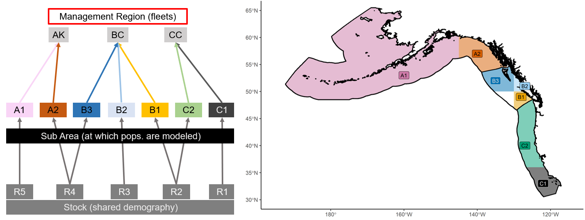
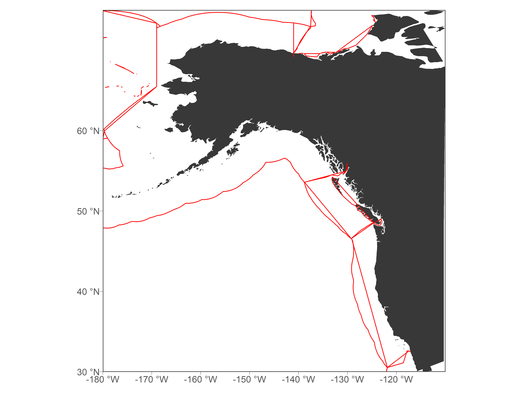
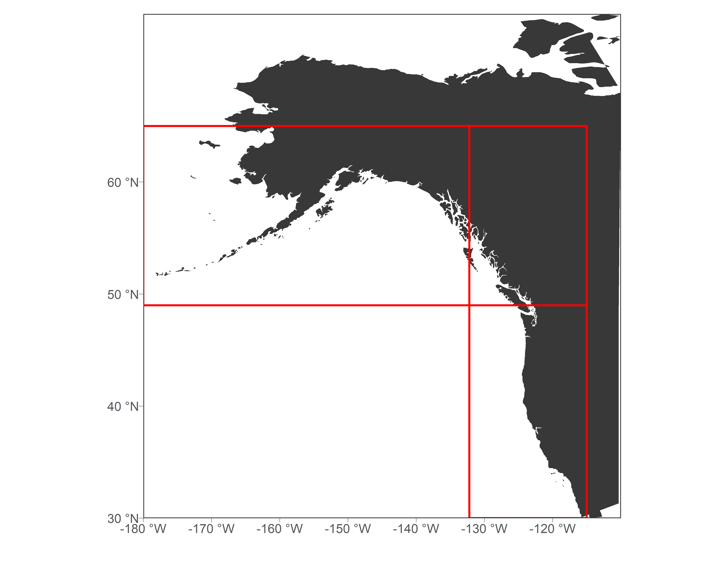
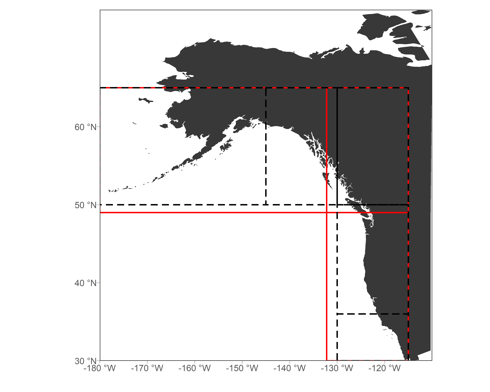
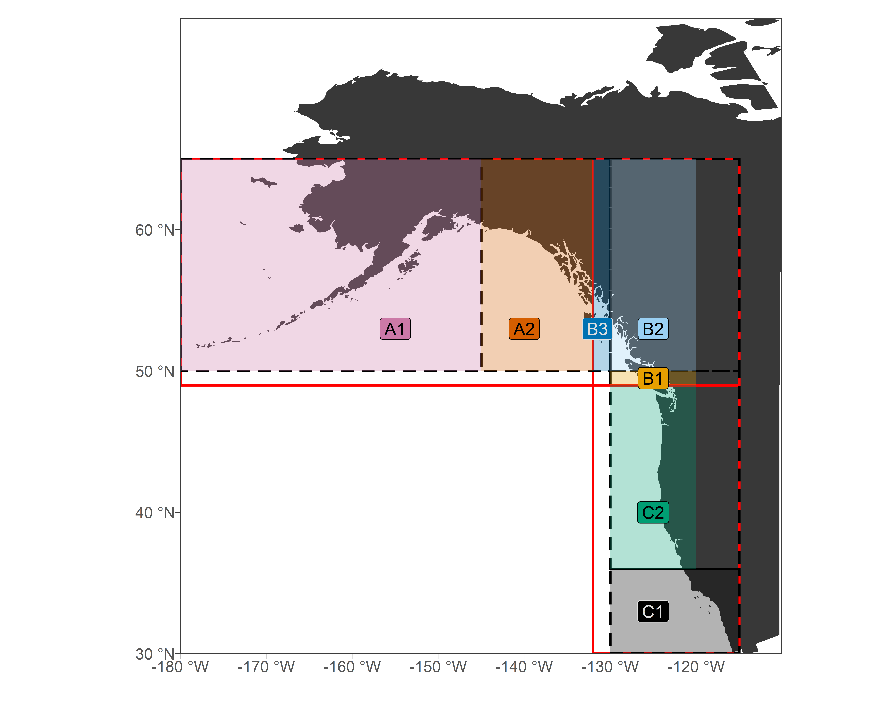
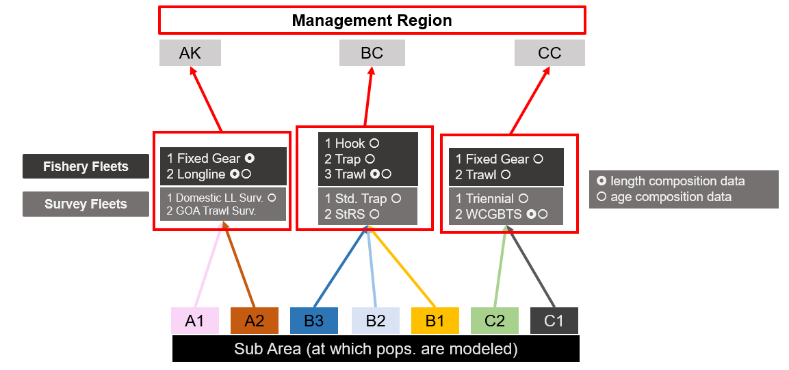
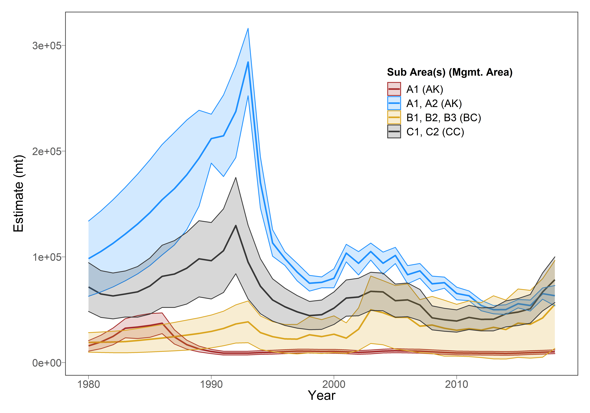
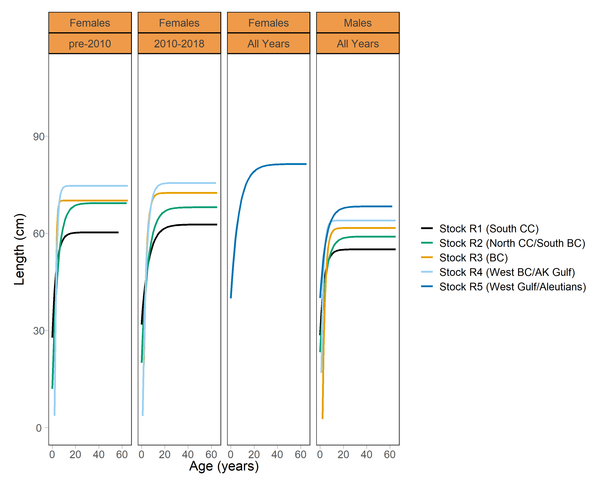

```{r options, include = FALSE, eval = TRUE}
knitr::opts_chunk$set(warning = FALSE, message = FALSE,fig.align='center',
                      fig.width = 3, fig.height = 3,
                      comment = NA, rows.print = 16)
```

layout: true

.header[`r icon::fa('github')` @mkapur/sab-mse/]

---
# Objectives

+ Provide overview of Operating Model design (beta, obviously)
+ Discuss assumptions, data inputs & treatment


???
This is the reference for a dialogue (I'm not the only one talking)
Everything here is in doc; there are several places that aren't super fleshed out
---

# Outline
.inverse[Ground Floor OR the 30,000 foot view]
+ OM Spatial Structure
+ Data Inputs

--

.inverse[Data Generation] & .inverse[OM Conditioning]

+ What gets produced, how, and why
+ Walk-through equations for dynamics and likelihoods from document 
+ Discuss as we go (interrupt me  `r emo::ji("smile")`)

???
Don't forget that it is easy to add n selex curves, harder to change the array structure

---


background-image: url("https://www.thoughtco.com/thmb/Bt4hhUDgr_LhLP5hEh6pP_2o2iM=/768x0/filters:no_upscale():max_bytes(150000):strip_icc()/closed-lift-door-1051317118-5c64607a46e0fb0001587ce5.jpg")
background-size: cover
<br><br><br>
# .inverse[Ground Floor]

---
# Ground Floor

+ OM is run in `R` 
+ Conditioning/estimation happens in `TMB` 
+ We are `not` shooting to replicate Stock Synthesis (etc.) exactly in structure nor estimated quantities 


???
For example, R scripts pre-process the data, but TMB code uses that data to produce an expected Numbers-at-age matrix, estimate parameters, etc, then pass back to R for plotting
---
# Spatial Structure
+ A little more complicated than expected (Figure 1)



--

+ Let's walk through how these came about

---

# Spatial Structure

```{r, echo = -1, eval = TRUE, out.height=400, out.width= 500}

```

???

Also -- Space is confusing, so let's abstract these 
---

# Management Regions

```{r, echo = -1, eval = TRUE, out.height=400, out.width= 500}

```

???
Simple lines for illustration -- not spatially ok
we trust that everything accuring to AK happens in that box

---
## Stock (demography)

```{r, echo = -1, eval = TRUE, out.height=400, out.width= 500}

```

???
overlaying these strata gives many splices, but some can be ignored


---

## Sub-Areas (what's modeled)

```{r, echo = -1, eval = TRUE, out.height=400, out.width= 500}

```
???
the union of those two = this, finest strata

---


### Putting it all together (fleets + surveys)


???
that was RHS of F1
LHS is a schematic showing how information flows -- you can see how it's important to keep track
spoiler: this is done via matrices


next up is what happens where -- but pause for any questions

---
# What happens where
## Management Regions $m$ 

.pull-left[

Alaska (.inverse[A]K), British Columbia (.inverse[B]C), Cal. Current (.inverse[C]C)
  + Contain fleets
  + Accrue catches
  + Calc reference points
  + Set ABCs (future, as one test within MSE)


]

.pull-right[

]
---
# What happens where
## Stocks $k$

.pull-left[

R1:R5, as in Kapur et al. (2020)
+ Share params for growth, maturity(?), density-dependence
+ SRR operates @ $k$ and is partitioned
]

.pull-right[

]


???
stock is actually unit of interest
---
# What happens where
## Sub-areas $i,j$

.pull-left[
+ A,B,C = AK-, BC-, CC-nested
+ Strata @ which populations are modeled (e.g. $N_a^i$)
]

.pull-right[


]
???
The first letter of the subarea gives you a hint which mgmt area it is nested within.
A table with all subscript & param definitions is provided near the end of the OM document.
---
background-image: url("https://dynaimage.cdn.cnn.com/cnn/q_auto,h_600/https%3A%2F%2Fcdn.cnn.com%2Fcnnnext%2Fdam%2Fassets%2F191202162449-ingredients-to-longevity-3.jpg")
background-size: cover
<br>
# .inverse[Data Inputs]
---
# .small[Data Inputs: Catches & Comps]



--

+ `Fixed Gear` for CC is Hook & Line + Pot
+ any others to combine/add/drop?

???
This is figure 2
The last thing I want to add is about survey fleets; those involved with my sptl temporal std work know that i developed a novel index usting VAST. this means that i actually have unique "survey fleets" for each region which are composites
---
# .small[Data Inputs: Surveys]

```{r, echo = -1, eval = TRUE, out.height=300, out.width= 500}

```
Note that these are novel "fleets" not equivalent to survey comps fleets.

---
# .small[Data Inputs: Growth]
```{r, echo = -1, eval = TRUE, out.height=350, out.width= 500}

```

$\sigma_G$ .small[ now at individual strata
+ Movement & Maturity from collaborators
+ We can discuss $h$, $M_a$ et al. once dynamics are introduced
]


---
background-image: url("./img/joe1.jpg")
background-size: cover
<Br><Br><Br><Br><Br><Br>
# .inverse[Take a break?]
## .inverse[Up next: Data Generation & OM Conditioning]


---

background-image: url("https://www.thespruceeats.com/thmb/nsjMWi7TBf7AVMBFulYM3XQOYiQ=/2400x1350/smart/filters:no_upscale()/bowl-chili-98839917-56a8c4ab3df78cf772a0723d.jpg")
background-size: cover
<br><br><br>
# .inverse[Data Generation]
---
# Data Generation 
## What comes out of the OM?

Time series of...
+ Surveyed abundance, by fleet
+ Age & Length compositions, by fleet (where applicable)
+ Catch & discards
+ Numbers-at-age/length
+ Biomass 
+ Parameters e.g. $F$, selectivity, $R_0$

--

...All of which can be used as .inverse[input data] or .inverse[parameter inits] in future EMs.

???
1st three things are basically estimates of the data we put in


---
background-image: url("https://media.giphy.com/media/10uVasOeFs6U92/giphy.gif")
background-size: cover
<br><br><br>
# .inverse[Model Conditioning]
---
# Model Conditioning
## Approach
+ Template Model Builder w/ modular structure (see SAM)
+ Starter equations under "Likelihood Components", page 13
+ Let's discuss general objectives, and get into details in tandem with dynamics
---
# Model Conditioning
## Objectives
+ Fit the input data
+ Roughly reproduce trends from regional assessments

--

+ .inverse[others?]

???
On the "reproduce" point, I am not positive how well matched it will be dependong on movement outcomes
I can certainly see place for a validation step w movement off

In the dynamics section, when I walk thru equations I will include standout likelihood issues/estimation questions
---
background-image: url("https://www.vaughn.edu/wp-content/uploads/2019/04/Math-Equations-on-Chalkboard-1024x407.jpg")
background-size: cover
<Br><Br><Br><Br><Br><Br>
# .inverse[Operating Model Dynamics]
### .inverse[...and conditioning concerns]

---
# OM Dynamics

**Equation in Document**
+ Key assumptions

--
<Br>
+ Conditioning concerns (if applicable)

--
<Br>
+ .inverse[Discussion Points]

---
# .small[Numbers at Age]
.small[
$N_{y+1,\gamma,a}^i=\left\{\begin{matrix}0.5R_{y+1}^i & \text{if}\ a = 0 \newline \sum_{i\neq j}\left[\left(1-\textbf{X}_a^{i,j}\right)\left.\ {N_{y,\gamma,a-1}^ie}^{-Z_{y,\gamma,a-1}^i}\right.+\textbf{X}_a^{j,i}{N_{y,\gamma,a-1}^je}^{-Z_{y,\gamma,a-1}^i}\right] & \text{if}\ 1 \leq a <A\\\sum_{i\neq j}{\left[\left(1-\textbf{X}_a^{i,j}\right)(\left.{N_{y,\gamma,A-1}^ie}^{-Z_{y,\gamma,A-1}^i}\right.\left.+{N_{y,\gamma,A-1}^ie}^{-Z_{y,\gamma,A-1}^i}\right.)\right.\ } & \text{if}\ a = A \\\ldots+\left.\textbf{X}_a^{j,i}\left({N_{y,\gamma,A}^je}^{-Z_{y,\gamma,A}^j}+{N_{y,\gamma,A-1}^je}^{-Z_{y,\gamma,A-1}^j}\right)\right]\\\end{matrix}\right.$
]

**Eq 1**

+ Yearly timestep
+ Monitored by sub-area $i$
+ Movement defined by $\textbf{X}^{i,j}_a$
+ .inverse[Plus group for age - 95?]

---
# Growth I [general]
$L_{y+1,\gamma,a}^i=L_{y,\gamma,a}^i+(L_{\infty,\gamma}^i-L_{y,\gamma,a}^i)\left(1-e^{-\kappa_\gamma^i}\right)\ if\ a\ <\ A$

**Eq 2**
+ Growth indexed by stock $k$ via Kapur et al. (2020)
+ Plus group via weighted average **Eq 3**
+ .inverse[Plus group for length: 50cm?]

?? initial growth not in there yet, likely as in SS
?? linear growth before a certain age $L_{0, \gamma,a} = L_\infty + 

---
# Growth II [after movement]
$L_{y+1,\gamma,a}^i=\phi_{ij}\frac{N_{y+1,\gamma,a}^iL_{y,\gamma,a}^i+N_{y+1,\gamma,A}^jL_{y,\gamma,a}^j}{N_{y+1,\gamma,a}^i+N_{y+1,\gamma,a}^j}$

**Eq 5**
+ Unlike SS, no growth "morphs"
+ Only matters if moving to a new stock
+ Incoming fish influence $L^i_a$ similar to plus-group

???
If fish moves to a new sub-area, it influences the mean length in that sub-area, then obtains growth patterns & corresponding movement probabilities from its sub-area $i$ of residence

Theoretically this could induce shrinkage, but hopefully most of the movement isn't north to south which would cause this to happen.
Part of the rationale is that we would otherwise need to track individual growth histories and end up with an IBM like situation: if fish from A1 move to B2 then a bunch move to C2 etc. Instead, the new movement probs AND growth patterns are shared for everyone extant in sub-area i.
---
# Length to Weight
.small[
$\widetilde{\textbf{L}_{y,\gamma,a,l}^i}=\left\{\begin{matrix}\mathrm{\Phi}(\theta_1,\widetilde{L_{y,\gamma,a}^i},\sigma_{y,\gamma}^i)&if\ l\ =\ 1\\\mathrm{\Phi}(\theta_{l+1},\widetilde{L_{y,\gamma,a}^i},\sigma_{y,\gamma}^i)-\mathrm{\Phi}(\theta_l,\widetilde{L_{y,\gamma,a}^i},\sigma_{y,\gamma}^i)&if\ 1\ <l\ <\ A_l\\1-\mathrm{\Phi}(\theta_l,\widetilde{L_{y,\gamma,a}^i},\sigma_{y,\gamma}^i)&if\ l\ =\ \ A_l\\\end{matrix}\right.$ 
]

$w_{\gamma,l}^i=\alpha_\gamma^i{\bar{L_l}}^{\beta_\gamma^i}$ 

**Eqs 7, 9**
+ The tilde indicates mid-year biomass, used for samples; similar calc. for start of year using $\textbf{L}_{y,\gamma,a,l}^i$
+ $\alpha, \beta$ .inverse[vary by stock]
+ different $w_a$ for captured fish

---
# Reproduction I
$R_y^k=\frac{4h^kR_0^kS_y^k}{S_0^k\left(1-h\right)+S_y^k(5h-1)}e^{-0.5\sigma_R^2+{\widetilde{R}}_y^k}$ 

$S_y^k=\sum_{a}{\phi_{ik}N_{y,\gamma=female,a}^iw_{y,\gamma=female,a}^kE_a^k}$ 

**Eqs 12, 13**
+ Density dependence spatial Bev-Holt at stock level $k$
+ SSB in $k$ is summation over $i$ in $k$ (invoke the magic of $\phi_{ik}$)

---
# Reproduction II
.large[
$R_y^i=\tau_{ik}R_y^k$ 
]

**Eq 15**
+ Recruitment happens at stock $k$ and is partitioned into sub-area $i$
+ Likely user-defined, by geographic area


---
# Reproduction III
.large[
$R_y^k=\frac{4h^kR_0^kS_y^k}{S_0^k\left(1-h\right)+S_y^k(5h-1)}e^{-0.5\sigma_R^2+{\widetilde{R}}_y^k}$ ]

**Eq 12**
+ Steepness $h^k$ .inverse[estimated with penalty/as hyper-parameter?]
+ RecDevs penalized with a .inverse[bias correction ramp?]

---
# Discards

${\Omega}_{y,\gamma,a}^f=\beta_3^{y,f,\gamma,a}\left(1+exp(-a-(\frac{\beta_1^{y,f,\gamma,a}+\beta_4^{y,f,\gamma,a}}{\beta_2^{y,f,\gamma,a}})\right)^{-1}$

**Eq 16**
+ Discards *and* discard mortality are modeled...
+ .inverse[Thus discard input data are not pre-adjusted by mortality]
+ Such rates are fixed, but included in tuning of $F$

---
# Retained Catches
$C_y^{m,f}=\sum_{i\epsilon m}\sum_{\gamma}{\sum_{a}{\phi_{if}w}_{\gamma,a}^f\frac{s_{\gamma,a}^fF_y^f\mathrm{\Omega}_{y,\gamma,a}^f}{Z_{y,\gamma,a}^i}N_{y,\gamma,a}^i(1-e^{-Z_{y,\gamma,a}^i})}$

--

+  $w^f_{\gamma,a}$ .inverse[is fleet- and sex- specific weight-at-age for captured fish (assumed equivalent for all sub-areas $i$ fished by $f$)]
+ Hybrid method used to tune $F$ and generate $C_{pred}$, using total mortality (incl. discard, **Eqs 19:24**)

--

**Eq 17**
+ Baranov (Ricker, 1975): catches occur by fleets $f$ in sub-areas $i$, and accrue to mgmt regions $m$.
+ $\phi_{if}$ determines whether or not $f$ exploits $i$
---
# Survey Biomass
$B_y^f={\epsilon_y^fq}^f\sum_{i}\sum_{a}{ \phi_{if} w_a^{k,f} s_a^f N_{y,a}^i}$

**Eqs 33,34**
+ $\epsilon_y^f~lognormal(0,0.2+\sigma_{S,y}^f)$ .small[ , where] $\sigma_{S,y}$ .small[comes from VAST ]
+ $q^f$ estimated
---
# Comps I (simple proportion)

$\pi_{y,a}^f=\frac{C_{y,a}^f}{\sum_{a}\ C_{y,a}^f}$

**Eq 35** - can susbstitute $l$ for $a$
---
# Comps II (likelihood)

$$L_\pi^f=\frac{\mathrm{\Gamma}(n_y^f+1)}{\prod_{a}^{A}{\mathrm{\Gamma}(n_y^f\widetilde{\sum_{\gamma}\pi_{y,\gamma,a}^f}+1)}}\frac{\mathrm{\Gamma}(\theta^fn_y^f)}{\mathrm{\Gamma}(n_y^f+\theta^fn_y^f)} \\
\ldots \prod_{a}^{A}\frac{\mathrm{\Gamma}(n_y^f\widetilde{\sum_{\gamma}\pi_{y,\gamma,a}^f}+\theta^fn_y^f\sum_{\gamma}\pi_{y,\gamma,a}^f)}{\mathrm{\Gamma}(\theta^fn_y^f\sum_{\gamma}\pi_{y,\gamma,a}^f)}$$
** Eq 54** 
+ .inverse[Dirichlet-Multinomial likelihood contribution]
+ Estimate $n_{eff}$ using $\theta^f$; potentially use for data weighting


---
# Equilibrium Abundance

$N^i_{0,\gamma,a} =\begin{cases}  0.5 \omega^i_a \tau_{ik} R^k_0 e^{-{ \sum_a M_a^k} }& \text{if}\ a < A \\ \omega^i_a \frac{N^i_{\gamma,A-1} e^{-{ \sum_a M_a^k} }}{1 - e^{-{ \sum_a M_a^k} }} & \text{if}\ a = A\end{cases}$

+ $\omega^i_a$ is the eigenvector of the movement transition matrix
+ The entry for $\omega^i_0$ is an estimated parameter
+ $\tau_{ik}$ is pre-specified distribution of recruits from $k$ to nested sub-areas $i$


--

+ .inverse[Likely want to but some variation around one or both of these]
---

# Initial Conditions 
$A$ years of movement, rec-devs and no fishing:

$N^i_{init,\gamma,a} =\begin{cases}  0.5 \omega^i_a \tau_{ik} R^k_0 e^{-{ \sum_a M_a^k} }e^{-0.5\sigma_R^2+{\widetilde{R}}_y^k} & \text{if}\ a < A \\ \omega^i_a \frac{N^i_{init-1,\gamma,A-1} e^{-{ \sum_a M_a^k} }}{1 - e^{-{ \sum_a M_a^k} }}e^{-0.5\sigma_R^2+{\widetilde{R}}_y^k} & \text{if}\ a = A\end{cases}$

---
background-image: url("./img/joe2.jpg")
background-size: cover
<Br><Br><Br><Br><Br><Br>
# .inverse[Take a break?]
## .inverse[Up next: Reference points, forecasting, and "misc"]


---
# Reference Points 
**Eqs 38:43**
+ Calculated for each mgmt region
+ Use time-averaged selex for each fleet within $m$
+ Summations as needed

--

+ AEP: "[Reference Points in Spatial Models] are an active area of research."
---
# Forecasting 
## Observation Error
+ Resample comps, surveys
+ .inverse[Fix catches to average of previous 5 years, or use current ABCs, or...]


## Process Error
+ If we implement a bias-correction ramp, set $b_y$ (penalty) to 0.5 for projected years
+ Any changes to demography?
---
# Other things I haven't thought through yet (in detail)
+ .inverse[Aging Error]
+ .inverse[Data Weighting]
+ .inverse[Expansions]
+ .inverse[What else?]
---

## Misc Questions 
## [copied from Google Doc]
+ start year for whole model
+ aging error
+ expansions of comps, etc
+ data availability (by stock vs mgmt area)
+ treament of sample sizes -- dirichlet?
+ hyperparameters e.g. steepness, penalty on recdevs

---
background-image: url("./img/thankyou2.jpg")
background-size: cover
<Br><br><Br>
# .inverse[Thank you!]