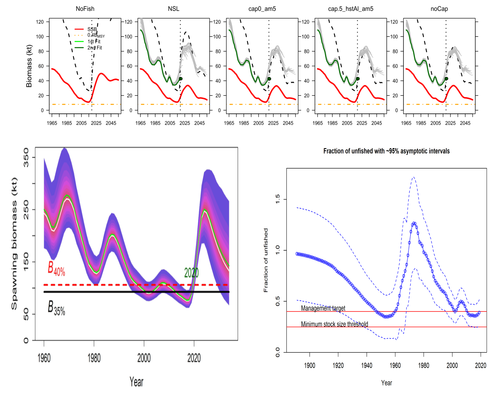
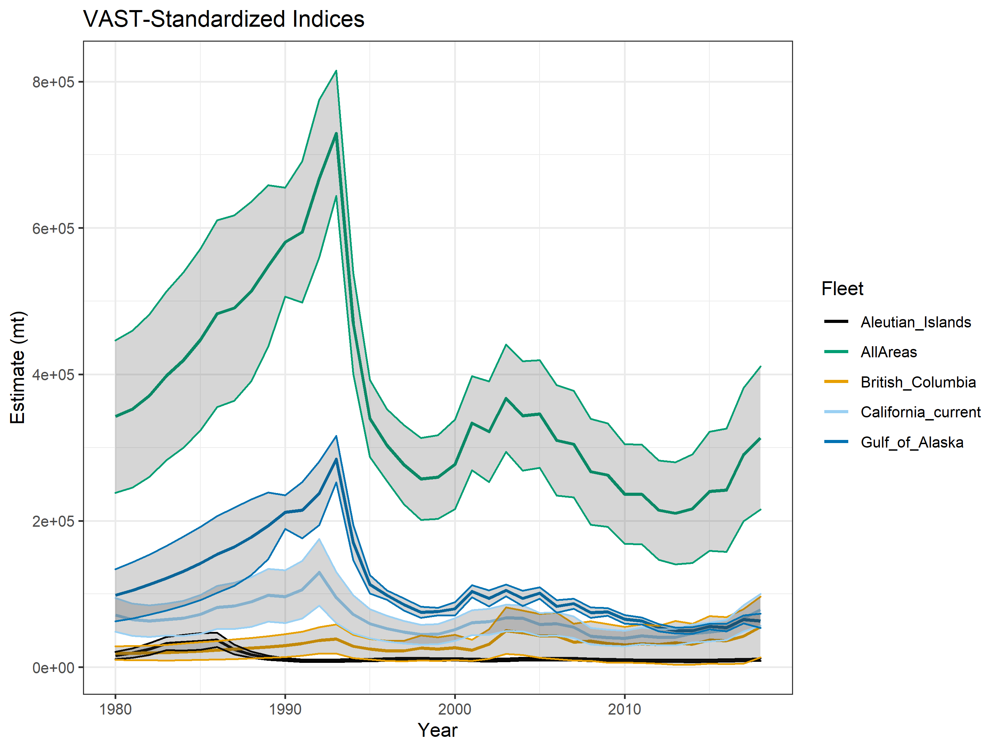
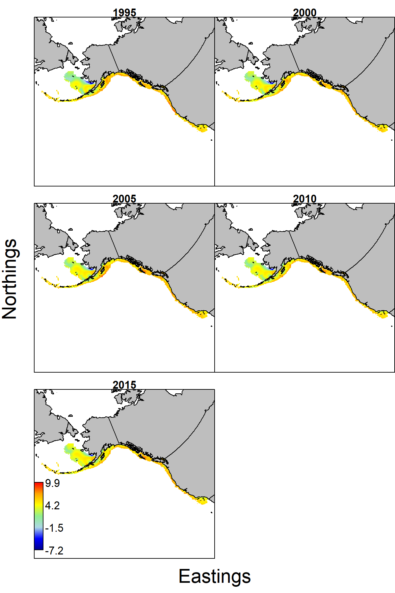

```{r xaringan-themer, include = FALSE}
library(xaringanthemer)
# solarized_dark( 
#    text_font_size = "25px",
#   header_font_google = google_font("Helvetica", "400"),
#   text_font_google   = google_font("Helvetica", "300", "300i"),
#   code_font_google   = google_font("Source Code Pro"), 
#   outfile = "solarized-dark.css")
```

```{r options, include = FALSE, eval = TRUE}
knitr::opts_chunk$set(warning = FALSE, message = FALSE,fig.align='center',
                      fig.width = 3, fig.height = 3,
                      comment = NA, rows.print = 16)
```

layout: true

.header[`r icon::fa('github')` @mkapur/sab-idx]

---

# Motivation
```{r, echo = -1, eval = TRUE, out.height=400, out.width= 500}
knitr::include_graphics("img/RawIndices_TM.PNG")
```


???
outward motivation was that we had seen syncronous trends across surveys

---
# Motivation
```{r, echo = -1, eval = TRUE, out.height=400, out.width= 500}
knitr::include_graphics("img/RawIPHC_TM.PNG")
```

???
and at the time of our tech memo, it looked like synchronous decliens (here of cours is the IPHC survey which isn't used)

---

# Motivation
Synchronous trends (incl. declines) in relative abundance

```{r, echo = -1, eval = TRUE, out.height=400, out.width= 500}

```

???

nevertheless those survey trends persist into model estimates of SSB; top row is five candidate OMs from BC, bottom left is recent AK assessment and right is CC assessment

- see if combining surveys gives coherent picture (there might be something spatial happening)
- wanted to do this for use in OM

---

# Methods I
+ VAST (Thorson, 2019)
Probability distribution function for biomass data $b_i$
$$
 \begin{equation}
    Pr(B = b_i)=
    \begin{cases}
    1-r_1(i) & \text{if}\ B=1 
    \newline
    r_1(i) \times \Gamma(B = b_i | r_2(i), \sigma_m^2(c_i))  & \text{if}\ B >0
    \end{cases}
  \end{equation}
$$
+ $r_1$ is encounter rate (logit-link); $r_2$ is capture probability for sample $i$ (gamma-distributed)
+ $\sigma_m^2(c_i)$ is residual variation for each sample

???
obv more than jsut this equation, but the underlying principal is that est biomass is a combination of probability of encountering and capturing,
and also space & time matters
Originally we thought we couldn't, but assuming BC encounters everything

---
# Methods II
+ "Calibration by Proximity" (CBP, Thorson et al., in prep)
+ estimates log-ratio of catchability between surveys and reference
+ $\lambda_f = log( \frac{q_f}{q_{f_{ref}}})$
+ this is to generate survey estimates; not committed to using $\hat q_f$ in OM

???

CBP – everyone’s doing it

Thorson in prep, same data sources

Idea is working with overlapping stuff but want to stictch together

Assumes that biological differences independent of management boundaries


Important underpinning is q, for same reasons we did time blocks, highly influential for biomass

Select a ref fleet, estimate log ratio of catch for all others vs reference

Trap survey has very different values for “effort”, not km2

First month of data, having massive problems with estimation (order of magnitude), but…







For non-overlapping surveys, however, the model cannot estimate catchability via average differences in catch-rate at the same location and time. 

It therefore informs estimated differences in catchability via the correlation in density between nearby locations that are sampled in the same year. 

We’re lucky that we have some overlap



This is because we use log link for ni and wi.
---
# Methods III

+ Experimented with 100, 250, 500 and 1000 knots; retained 500 due to runtime
+ Sensitivity to alternative 'reference fleet'
+ (baseline reference fleet = AK Domestic LL survey)
+ BC StRs as reference could not converge
+ WCGBTS as reference was very precise for WC but CIs included zero for other regions


???

This is likely due to the fact that the trap survey virtually never captures zero sablefish, rendering the catchability of encountered biomass in that region so dissimilar to others that the log-ratios could not be estimated.  Re-running the base model with the WCGBTS survey as reference produced a converged model (Figure 4) with very precise trends for the West Coast, nearly identical to those used in the assessment for that survey. However, model estimates for the Triennial survey were less similar to the assessment, and those for AK and BC were very imprecise (with standard errors including zero) despite mean trends agreeing largely with the previous values used in the assessments. This is likely due to the fact that the WCGBTS does not contain data for the first few decades in the standardization, so estimated log-ratios are based on inferred (and thus more uncertain) values. 
---
# Data Inputs
Multiple surveys, coverage 1970-2018
```{r, echo = -1, eval = TRUE, out.height=400, out.width= 300}
knitr::include_graphics("img/datamap_size.png")
```
---

# Data Treatment
+ GOA Trawl survey < 500m, remove 1984 & 1987
+ Timeblocking: Triennial before/after 1993; AK Surveys before/after 1992

---
### VAST Index: Compared to previous
```{r, echo = -1, eval = TRUE, out.height=400, out.width= 800}
knitr::include_graphics("img/compare_all.png")
```

???
AK AND BC ASSESSMENT have been multiplied by 1000 to show here; VAST is very clear that it can at best reproduce TREND, not scale. I in turn had to divide all inputs by 1000.

Recall it'll get treated as relabund in OM so not too concerned.

---
### VAST Index: Including "All Areas"
```{r, echo = -1, eval = TRUE, out.height=400, out.width= 800}

```
???
you'll see a relabeled version of this in OM talk
---
.pull-left[

]
--
.pull-right[
.inverse[Possible causes] of NW $\hat \beta$ Shift 
+ Migration GOA $\rightarrow$ EBS (unlikely due to age structure)
+ Cold pool (yet only recently in EBS)
+ Increased recruitment in EBS/pulses of large cohorts (e.g. 2016 incoming)
+ Change in fishery or demography (decline in $L_\infty$ of late)
+ Synergies of movement, recruitment, and oceanography
]

???
looking fwd to climate drivers discussion


---
background-image: url("./img/thankyou2.jpg")
background-size: cover
<Br><br><Br><br>
# .inverse[Thank you!]

