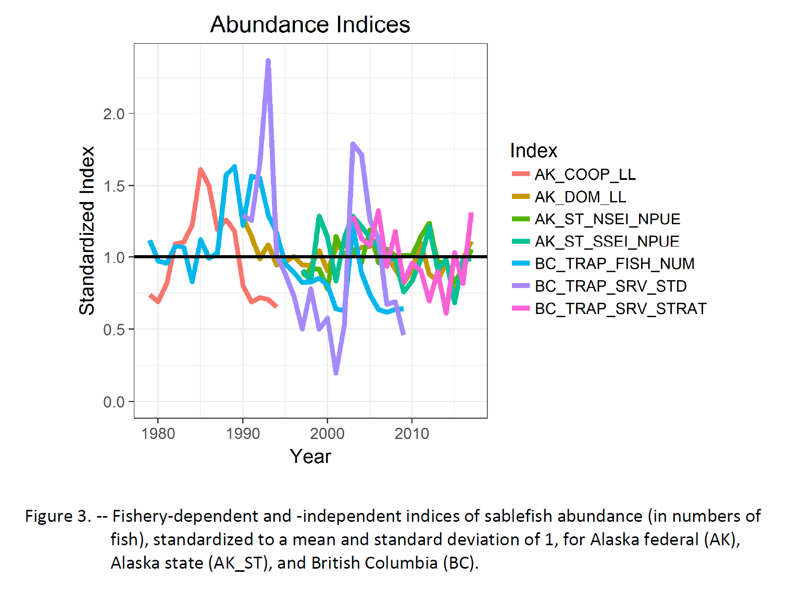
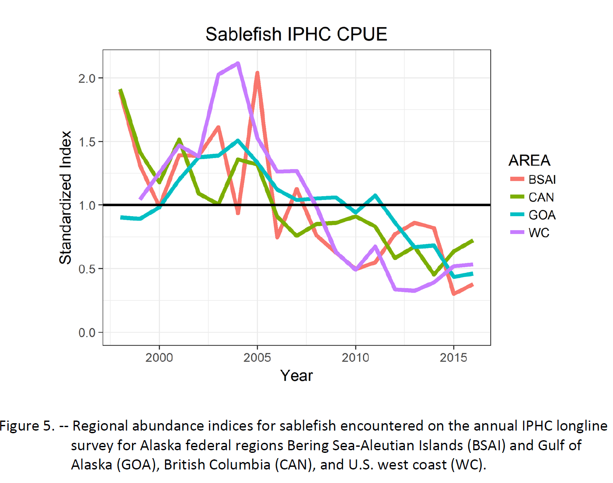
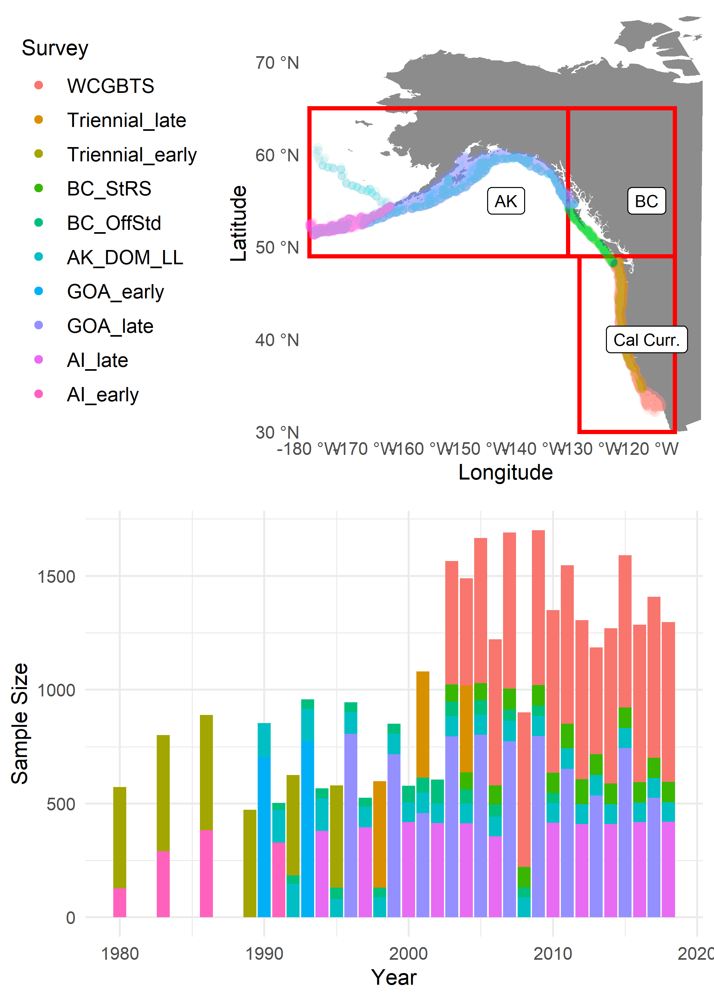
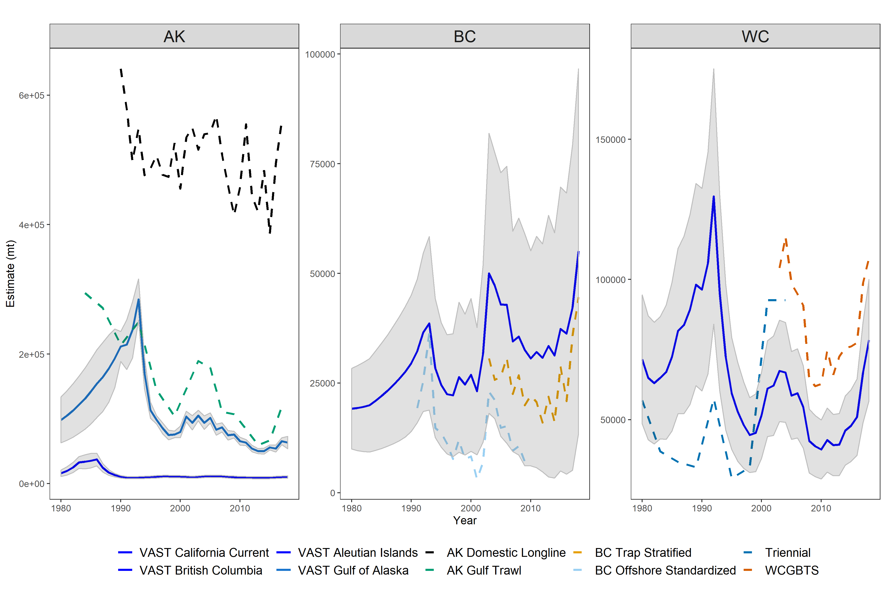

```{r xaringan-themer, include = FALSE}
library(xaringanthemer)
solarized_dark( 
   text_font_size = "25px",
  header_font_google = google_font("Helvetica", "400"),
  text_font_google   = google_font("Helvetica", "300", "300i"),
  code_font_google   = google_font("Source Code Pro"), 
  outfile = "solarized-dark.css")

# solarized_light( 
#   header_font_google = google_font("Helvetica", "400"),
#   text_font_google   = google_font("Helvetica", "300", "300i"),
#   code_font_google   = google_font("Source Code Pro"), 
#   outfile = "solarized_light.css")
```

```{r options, include = FALSE, eval = TRUE}
knitr::opts_chunk$set(warning = FALSE, message = FALSE,fig.align='center',
                      fig.width = 3, fig.height = 3,
                      comment = NA, rows.print = 16)
```

---
layout: true

.header[`r icon::fa('github')` @mkapur/sab-idx]

---

# Motivation
```{r, echo = -1, eval = TRUE, out.height=400, out.width= 500}

```

---
# Motivation
```{r, echo = -1, eval = TRUE, out.height=400, out.width= 500}

```


---

# Motivation
Synchronous trends (incl. declines) in relative abundance

```{r, echo = -1, eval = TRUE, out.height=400, out.width= 500}
knitr::include_graphics("img/figure2.PNG")
```
---

# Methods
+ VAST (Thorson, 2019)
+ Multiple surveys, coverage 1970-2018
+ "Calibration by Proximity" (CBP)
+ Full writeup on shared google drive

---

# Data Inputs
```{r, echo = -1, eval = TRUE, out.height=450, out.width= 300}

```

---

## Resultant Index, compared to previous
```{r, echo = -1, eval = TRUE, out.height=400, out.width= 800}

```
---

## Resultant Index
```{r, echo = -1, eval = TRUE, out.height=400, out.width= 800}
knitr::include_graphics("img/index-biomass2.png")
```

---
## Trends in $\hat \beta$ through time
```{r, echo = -1, eval = TRUE, out.height=450, out.width= 350}
knitr::include_graphics("img/NALn_density.png")
```
